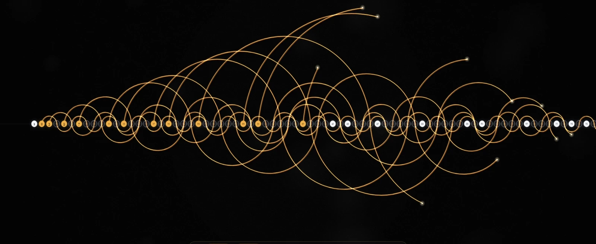

# Prime Sieve Arcs

An animation of the **Sieve of Eratosthenes**, the oldest way of finding prime numbers. Every prime hops along its own multiples in glowing arcs. A number that no arc lands on is prime.



## How it works

The sieve is a very old idea: write the numbers in a row, cross off every multiple of 2,
then every multiple of 3, and keep going. What survives is the primes.

This page draws that idea instead of writing it:

1. **Every number is there from the start**, as a white chip with its digits on.
2. **A scanner walks the line.** When it reaches a number that nothing has crossed off,
   that number is prime. The chip turns amber and a line starts growing from it.
3. **A prime `p` hops over its multiples:** `p` to `2p` to `3p` and on. Each hop is a half
   circle whose diameter is `p`, and the hops alternate above and below the line.
4. **A hop that lands on a number crosses it off.** The chip loses its digits and empties
   out to a bare ring. The numbers that keep their digits are the primes.
5. **The lines run ahead of the scanner**, so a composite is always already crossed off when
   the scanner gets there. That is why the scanner is never wrong, and it is the whole trick:
   the chain of a number's smallest prime factor set out earlier and moves faster.

Small primes make tight loops near the line. Large primes throw wide arcs across the screen.
The camera zooms out as the picture grows, keeping 1 pinned at the left, so the fan keeps its
shape while more and more numbers fit on screen.

## Features

- **The sieve, honestly** — nothing is faked. The scanner names a prime only when no arc has
  crossed the number, and the maths that guarantees that is covered by tests.
- **Live count** — the number the scanner has reached, how many primes it has found, and the
  newest one.
- **Your pace, your length** — two sliders set how fast the scanner walks and how far it
  counts. Both can be moved while it runs, and changing the speed does not move the picture,
  only the rate. The address bar follows, so the link you copy plays what you set up.
- **Deep link to one frame** — `?at=37` freezes the picture with the scanner on 37, ready to
  share.
- **Loops on its own** — it holds on the finished picture, fades out and starts again.
- **Respects reduced motion** — with the operating system set to reduce motion, the page shows
  the finished picture instead of animating.

## Controls

| Action | Keyboard | Pointer |
|---|---|---|
| Play or pause | `Space` | Click the canvas, or the Pause button |
| Restart | `R` | Restart button |
| Change the pace | | The **speed** slider: numbers a second |
| Change the length | | The **count to** slider: where the sweep stops |

The picture ends up about twice as wide as **count to**, because the lines run ahead of the
scanner. A higher number means a longer sweep and a smaller picture at the end.

## URL Parameters

| Parameter | Default | What it does |
|---|---|---|
| `limit` | fits the window | Highest number the scanner reaches (8 to 1200), the **count to** slider. By default it follows the window width, so the finished picture lands at about 26 pixels a number, the density of the last reference frame. |
| `speed` | `1.5` | Numbers per second for the scanner (0.25 to 12), the **speed** slider. At the default a sweep runs for about half a minute. |
| `ratio` | `2` | How much faster the pens draw than the scanner walks (1.05 to 6). Higher means the arcs run further ahead. |
| `at` | none | Freeze the animation with the scanner on this number, paused. |
| `loop` | on | `loop=0` stops on the finished picture instead of starting again. |

Example: [`?limit=200&speed=6`](https://triunitystudios.com/web-projects/prime-sieve-arcs/?limit=200&speed=6)

## Where the look comes from

The art style copies frames of a video that Guillem found and liked. The first frame is kept in this folder, at
[`reference/inspiration-frame.webp`](reference/inspiration-frame.webp), so the source of the look stays with the code. Nothing on the site links to it.

The frames carry no author or title, so the original maker is unknown. Everything here was rebuilt from scratch: the rule behind the arcs, the way the picture grows and the colours were all measured out of those frames, pixel by pixel. `AGENTS.md` records the measurements.

## How to Run

Open `index.html` in a browser, or serve the repository root with any HTTP server:

```bash
python -m http.server 8000
```

Then open `http://localhost:8000/web-projects/prime-sieve-arcs/`.

## Tests

```bash
bun test
```

## Tech Stack

Vanilla HTML, CSS, and JavaScript. No frameworks or dependencies.

## Live Version

[triunitystudios.com/web-projects/prime-sieve-arcs/](https://triunitystudios.com/web-projects/prime-sieve-arcs/)
